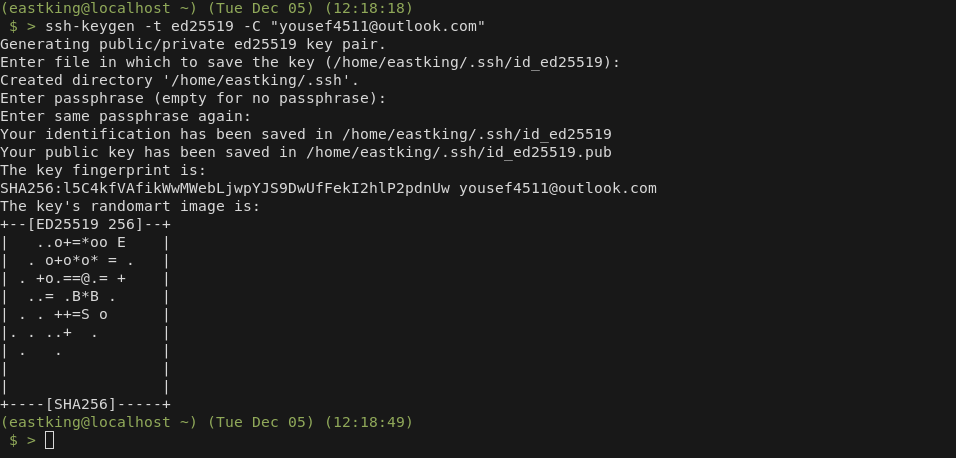
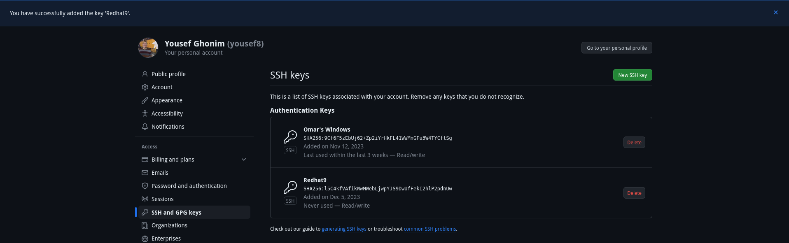
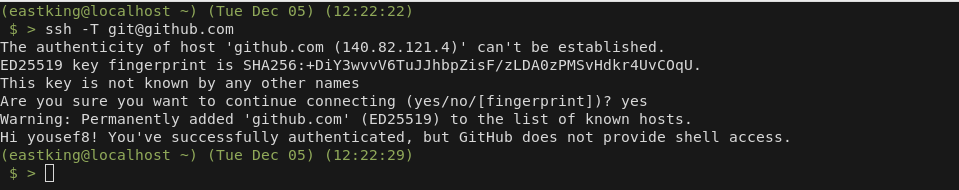
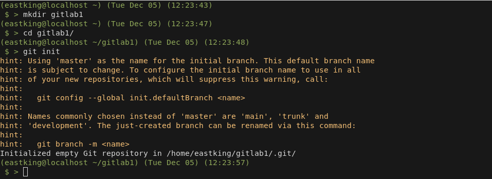
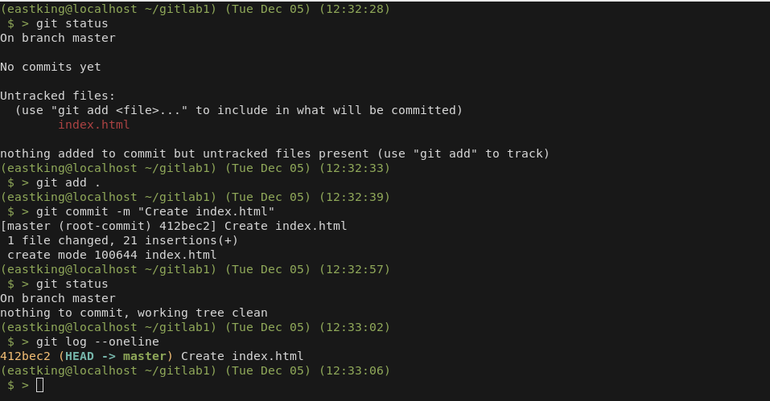
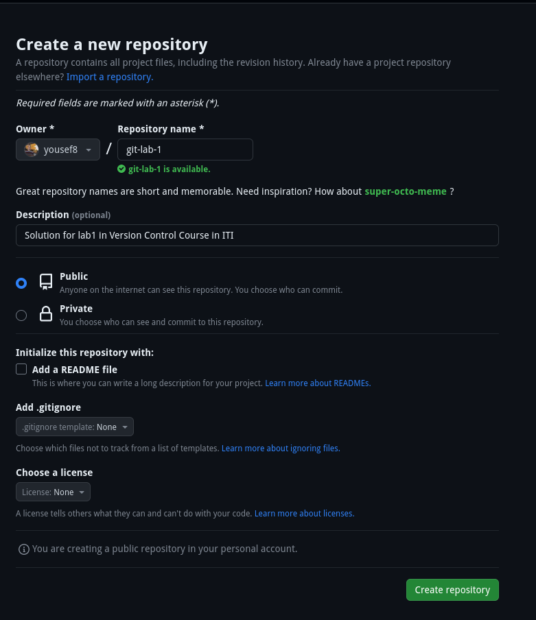
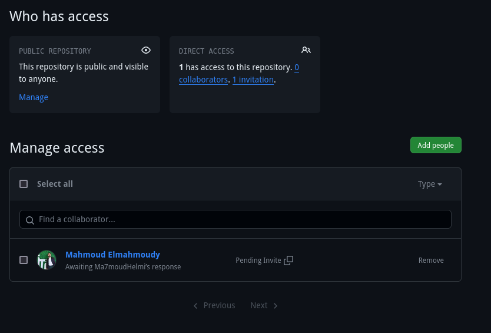

# Git Lab 1

## Q.1: Create a SSH key and put the key in GitHub?

## Q.2

1. **Crate a new Local Repo**

    

1. **Create a file to host on Githu Hosts**

    

1. **Create a new remote repo**

    

1. **Connect Local repo to Remote repo**

    
    

1. **Send Invitation**

    

## Q.3: Host your project with Github Pages

